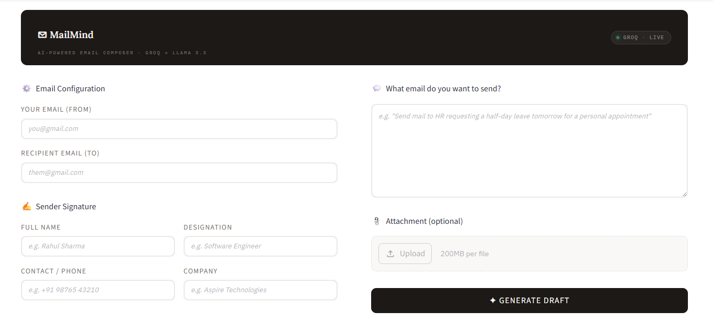
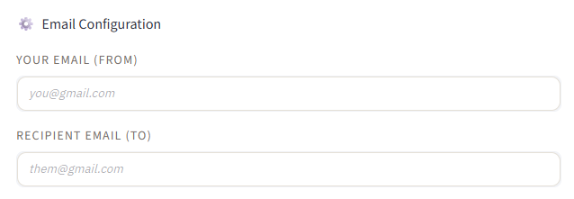
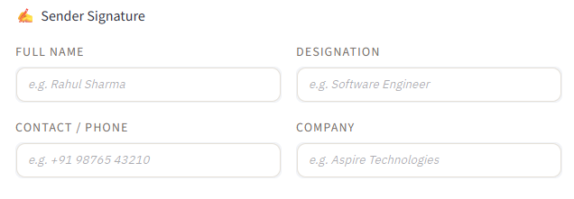
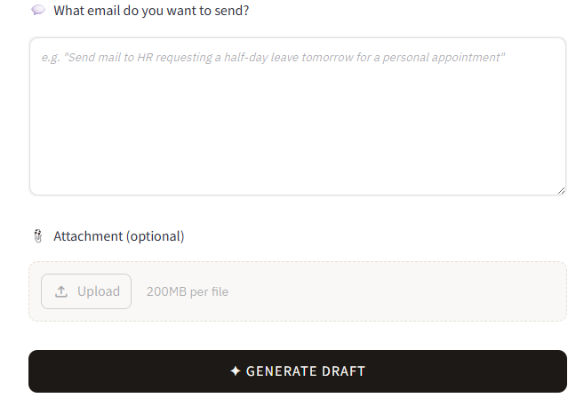
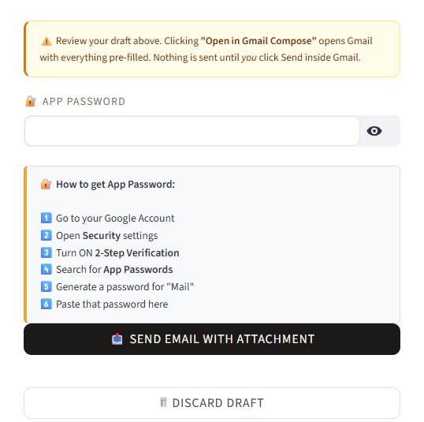

# ✉️ MailMind - AI Email Composer

<div align="center">

[](https://www.python.org/)
[](https://streamlit.io/)
[](https://groq.com/)
[](LICENSE)

**AI-Powered Email Composer using Groq + LLaMA 3.3**

[🚀 Live Demo](#) • [📖 Documentation](#) • [🐛 Report Bug](https://github.com/yourusername/mailmind/issues) • [✨ Request Feature](https://github.com/yourusername/mailmind/issues)

</div>

---

## 📋 Table of Contents

- [✨ Features](#-features)
- [🎯 What is MailMind?](#-what-is-mailmind)
- [🚀 Quick Start](#-quick-start)
- [📸 Screenshots](#-screenshots)
- [🛠️ Installation](#️-installation)
- [💡 Usage](#-usage)
- [🔧 Configuration](#-configuration)
- [📦 Requirements](#-requirements)
- [🤝 Contributing](#-contributing)
- [📄 License](#-license)
- [🙏 Acknowledgments](#-acknowledgments)

---

## ✨ Features

<div align="center">

| Feature | Description |
|---------|-------------|
| 🤖 **AI-Powered Writing** | Generate professional emails using LLaMA 3.3 via Groq API |
| ✍️ **Smart Signatures** | Create and preview custom email signatures |
| 📧 **Gmail Integration** | Direct links to compose emails in Gmail |
| 🔒 **Secure & Private** | No data storage - everything processed locally |
| 🎨 **Modern UI** | Beautiful, responsive Streamlit interface |
| ⚡ **Lightning Fast** | Powered by Groq's ultra-fast inference |
| 📱 **Responsive Design** | Works on desktop and mobile devices |

</div>

---

## 🎯 What is MailMind?

**MailMind** is an intelligent email composition assistant that leverages the power of Large Language Models to help you write better emails faster. Whether you're crafting business proposals, sending follow-ups, or composing professional correspondence, MailMind provides AI-powered suggestions while maintaining your personal touch.

### Key Benefits:
- **✨ Enhanced Productivity**: Generate email drafts in seconds
- **🎯 Improved Communication**: AI suggestions for tone and clarity
- **🎨 Professional Appearance**: Custom signature builder
- **🔗 Seamless Integration**: Direct Gmail compose links
- **🛡️ Privacy First**: No data collection or storage

---

## 🚀 Quick Start

<div align="center">

### One-Click Deploy

[](https://share.streamlit.io/yourusername/mailmind/main/app.py)

### Local Installation

```bash
git clone https://github.com/yourusername/mailmind.git
cd mailmind
pip install -r requirements.txt
streamlit run app.py
```

</div>

---

## 📸 Screenshots

<div align="center">

### 🏠 Main Interface
*Add your main application screenshot here*


*Replace this placeholder with your actual screenshot*

---

### ⚙️ Email Configuration
*Add your email configuration panel screenshot here*


*Replace this placeholder with your actual screenshot*

---

### ✍️ Signature Builder
*Add your signature builder screenshot here*


*Replace this placeholder with your actual screenshot*

---

### 🤖 AI Email Generation
*Add your AI email generation interface screenshot here*


*Replace this placeholder with your actual screenshot*

---

### 📧 Gmail Integration
*Add your Gmail integration screenshot here*


*Replace this placeholder with your actual screenshot*

</div>

**📁 Screenshots Directory Structure:**
```
screenshots/
├── main-interface.png
├── email-config.png
├── signature-builder.png
├── ai-generation.png
└── gmail-integration.png
```

> **💡 Pro Tip:** To add screenshots, simply replace the placeholder image paths with your actual screenshot files in the `screenshots/` directory.

---

## 🛠️ Installation

### Prerequisites

- Python 3.8 or higher
- Groq API key ([Get one here](https://console.groq.com/))

### Step-by-Step Installation

1. **Clone the repository**
   ```bash
   git clone https://github.com/yourusername/mailmind.git
   cd mailmind
   ```

2. **Create a virtual environment (recommended)**
   ```bash
   python -m venv venv
   source venv/bin/activate  # On Windows: venv\Scripts\activate
   ```

3. **Install dependencies**
   ```bash
   pip install -r requirements.txt
   ```

4. **Set up environment variables**
   ```bash
   cp .env.example .env
   # Edit .env and add your GROQ_API_KEY
   ```

5. **Run the application**
   ```bash
   streamlit run app.py
   ```

6. **Open your browser**
   Navigate to `http://localhost:8501`

---

## 💡 Usage

### Basic Email Composition

1. **Configure Email Settings**
   - Enter your email address (sender)
   - Enter recipient's email address
   - Set up your signature details

2. **Create Your Signature**
   - Fill in your name, designation, contact, and company
   - Preview how it will look in emails

3. **Generate AI Email**
   - Describe what you want to write about
   - MailMind will generate a professional draft
   - Review and edit as needed

4. **Send or Compose**
   - Use the Gmail integration link to open in Gmail
   - Or copy the content manually

### Advanced Features

- **Custom Prompts**: Write detailed instructions for specific email types
- **Signature Preview**: See exactly how your signature will appear
- **Draft Review**: AI-powered suggestions for improvement

---

## 🔧 Configuration

### Environment Variables

Create a `.env` file in the root directory:

```env
GROQ_API_KEY=your_groq_api_key_here
```

### Getting a Groq API Key

1. Visit [Groq Console](https://console.groq.com/)
2. Sign up for an account
3. Create a new API key
4. Add it to your `.env` file

---

## 📦 Requirements

- **streamlit** - Web app framework
- **groq** - Groq API client
- **python-dotenv** - Environment variable management

See [requirements.txt](requirements.txt) for exact versions.

---

## 🤝 Contributing

<div align="center">

We love your input! We want to make contributing to MailMind as easy and transparent as possible.

### Ways to Contribute

- 🐛 **Report Bugs**: [Open an issue](https://github.com/yourusername/mailmind/issues)
- ✨ **Suggest Features**: [Start a discussion](https://github.com/yourusername/mailmind/discussions)
- 📝 **Improve Documentation**: Help make our docs better
- 💻 **Code Contributions**: Fix bugs or add features

### Development Setup

```bash
git clone https://github.com/yourusername/mailmind.git
cd mailmind
python -m venv venv
source venv/bin/activate  # On Windows: venv\Scripts\activate
pip install -r requirements.txt
# Make your changes
# Test thoroughly
# Submit a pull request
```

</div>

---

## 📄 License

This project is licensed under the MIT License - see the [LICENSE](LICENSE) file for details.

---

## 🙏 Acknowledgments

<div align="center">

**Built with ❤️ using:**

- [Streamlit](https://streamlit.io/) - The fastest way to build data apps
- [Groq](https://groq.com/) - Ultra-fast LLM inference
- [LLaMA 3.3](https://llama.meta.com/) - Meta's powerful language model

**Special Thanks:**
- The amazing open-source community
- Groq for providing fast and affordable AI inference
- Streamlit for making web app development accessible

</div>

---

<div align="center">

**Made with ❤️ by [Komal Sharma]([https://github.com/yourusername](https://github.com/komal-sharma19/))**

[⬆️ Back to Top](#-mailmind---ai-email-composer)

</div>
